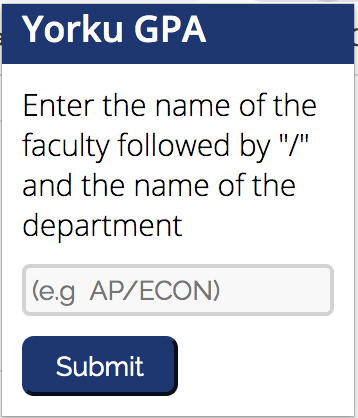

# GPACalculator

## About
* [Description](https://github.com/Simplyalex99/EECSCalculator/blob/master/README.md#description)
* [setup](https://github.com/Simplyalex99/EECSCalculator/blob/master/README.md#setup)
* [demo](https://github.com/Simplyalex99/EECSCalculator/blob/master/README.md#demo)
* [to-do](https://github.com/Simplyalex99/EECSCalculator/blob/master/README.md#to-do)
* [special-thanks](https://github.com/Simplyalex99/EECSCalculator/blob/master/README.md#special-thanks)

## Description
An extension for yorku students that calculates culminative gpa of one's query in  the degree progress report page (https://myacademicrecord.students.yorku.ca/degree-progress-report) or york university course grade page (https://myonlineservices.students.yorku.ca/ in course and grade list section)  

## setup
- Download the folder degreeProgressReport with its files (You can please find an arrow in the green bar "Code" subheading that has an option to download via zip)

- Add the files as a browser extension; In the browser go to extensions, enable dev tools and click "load unpack" then select the degreeProgess folder.
  Enable the extension as if might be set off and not appear next to extension icon.

- Copy the URL of the website and replace the URL next to the "matches" in manifest.json file with your URL of the page.

- Make sure to save then refresh the extension anytime changes are made.

- Click on the gpa calculator extension and then enter your choice. You can now see your gpa of choice whenever you need to!

-  **Note: If the following error appears on the console "runtime.lastError", refresh the webpage. Must also be on one of the webpages specified in the  description to calculate your choice of gpa**

## Demo
For example, entering LE/EECS will give you the overall gpa for all eecs courses including the courses  and grades corresponding to that faculty as well as total grade point and credits that can be used as a reference.

### To-do:
Improve structure of code for maintainability.

### Special thanks:
To all those who helped!
